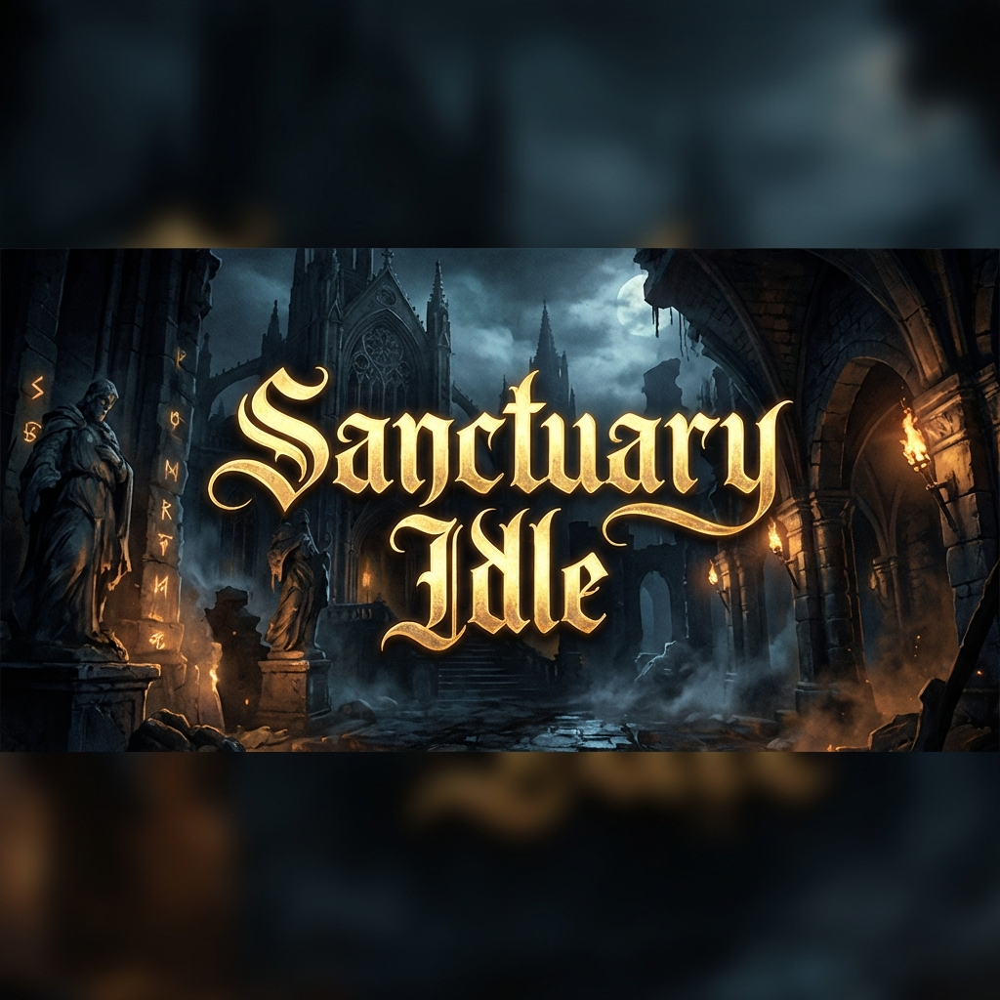
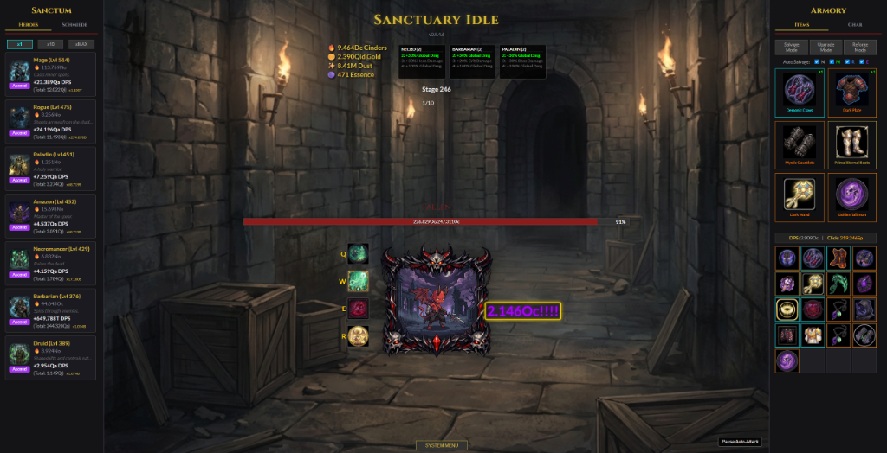

# Sanctuary Idle



**Sanctuary Idle** is a dark fantasy idle RPG and clicker game built with modern web technologies (HTML5, CSS3, Vanilla JavaScript). **Fully playable on your Smartphone or Desktop browser.** Dive into the world of Sanctuary, recruit powerful heroes, collect legendary loot, and ascend to godhood.



## 🌟 Features

*   **Multi-Class System**: Choose your affinity and build your team from 7 distinct classes:
    *   🧙‍♂️ **Mage**: Elemental destruction.
    *   🏹 **Amazon**: Speed and multi-shot precision.
    *   🛡️ **Paladin**: Holy defense and boss slaying.
    *   🗡️ **Rogue**: Critical strikes and gold generation.
    *   💀 **Necromancer**: Summon armies of the dead.
    *   ⚔️ **Barbarian**: Raw fury and click damage.
    *   🌿 **Druid**: Nature magic and hybrid utility.

*   **Deep Progression Systems**:
    *   **Level Up & Upgrades**: enhancing your global DPS and Click Damage.
    *   **Inventory & Loot**: Find items with 6 rarities (Normal to Unique). Equip gear to boost specific stats.
    *   **Crafting & Salvaging**: Salvage useless items for Dust and upgrade your best gear.
    *   **Paragon Board**: a massive skill tree to customize your build with stat multipliers and legendary nodes.
    *   **Ascension**: Reset your hero progress to gain powerful permanent bonuses.
    *   **Reincarnation**: The ultimate prestige layer. Reset everything to gain Divinity and buy game-changing Blessings.

*   **Engaging Combat**:
    *   Fight through endless stages of monsters.
    *   Challenge powerful Bosses with unique mechanics.
    *   Auto-combat system with manual click interaction.

*   **Responsive Mobile Design**: Optimized for both Desktop and Mobile play, including touch-optimized UI and controls.

## 🚀 Getting Started

### Play Locally
1.  Clone the repository:
    ```bash
    git clone https://github.com/Anzo1986/sanctuary-idle.git
    ```
2.  Open `index.html` in your web browser.

### Hosting
The game is a static web application. You can host it on GitHub Pages, Vercel, Netlify, or any static file server.

## 🛠️ Tech Stack
*   **Core**: HTML5, CSS3 (Variables, Flexbox/Grid), JavaScript (ES6+).
*   **Storage**: LocalStorage for saving progress.
*   **No Frameworks**: Pure Vanilla JS for maximum performance and educational value.

## 🤝 Contributing
Contributions are welcome! Feel free to submit a Pull Request.

## 📜 License
This project is open source.
